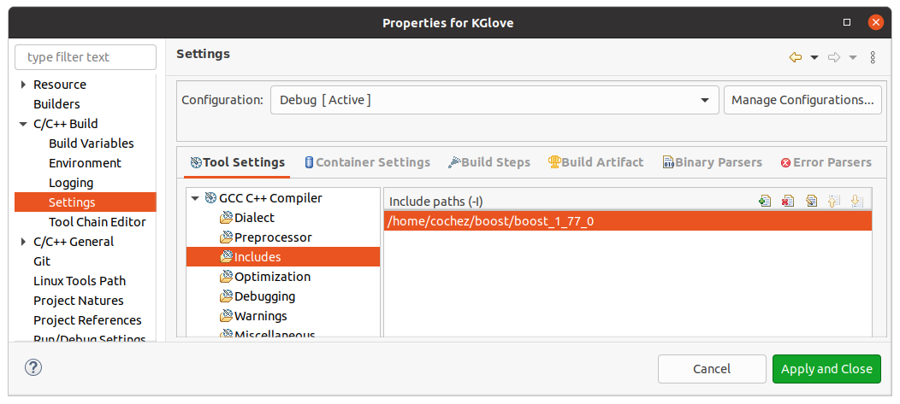
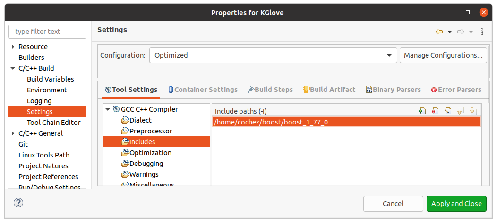

# Optimized Implementation of the KGloVe algorithm #

This repository contains an optimized implementation of KGloVe, which was proposed in


    Cochez M., Ristoski P., Ponzetto S.P., Paulheim H. (2017) Global RDF Vector Space Embeddings. In: d'Amato C. et al. (eds) The Semantic Web – ISWC 2017. ISWC 2017. Lecture Notes in Computer Science, vol 10587. Springer, Cham. https://doi.org/10.1007/978-3-319-68288-4_12


The goal of the algorithm is to create embeddings for nodes in a large knowledge graph.
This implementation has been used in graphs up to ~100M nodes, but using the current strategy to combine the forward and backward co-occurrence matrix, this needs a lot of memory.

This happens by first creating a co-occurrence matrix, which indicates up to what extend nodes are in each others context.
This matrix is analog to a global word-word co-occurrence matrix often used in NLP.
Then, this co-occurrence matrix is fed into the GloVe [[2]](#2) algorithm to create embeddings.

To create the co-occurrence matrix, KGloVe uses personalized page rank (PPR). Specifically, personalized page rank is computed using an adapted version of the bookmark coloring algorithm [[3]](#3).
The adaptation is such that computing PPR for all nodes in the graph is sped up by ordering computations such that previous PPR computations can be used as much as possible for later computations. The performance is depending on the graph structure; in an ideal case it is linear in the number of nodes.

A further feature of this implementation is that the transition probabilities (which in normal personalized page rank are uniform) can be biased using, so-called weighting functions.
This means that the random walks can, for example, be directed more often to nodes with a lower degree.


## Usage

The code in this repository only computes the co-occurrence matrix, compatible with the GloVe embedding implementation in https://github.com/stanfordnlp/GloVe

### configuration

The configuration of the run is hardcoded in Main.cpp, the default looks like this:

```c++
char const * fileName = "inputData/testInput/SmallTest.nt";
if (argc > 1) {
    fileName = argv[1];
}

KGloVe::Parameters p;
//p.graphs.push_back(std::tuple<string, bool, bool>("368303ALL_MergedMultiline_no-empty-lines_sort-uniq_error-boxer.nt", false, true));
p.graphs.push_back(std::tuple<std::string, bool, bool>(fileName, true, true));
weigher::UniformWeigher w;
//PushDownWeigherMap w(readDBPediaPageRanks("pagerank_en_2016-04.tsv"), 0.2);
p.weighers.push_back(&w);
p.alphas.push_back(0.7);
p.epss.push_back(0.00001);
p.onlyEntities.push_back(false);
p.includeEdges.push_back(true);
p.outputPrefix = "output/";

KGloVe::parametrizedRun(p);
```
This

1. uses the first command line argument as the input file
2. Uses an uniform weigher (changing this to another weigher from GraphWeigher.h, changes the transition probabilities)
3. Sets the alpha and aps parameters of the PPR/bookmark coloring algorithm to 0.7 and 0.00001
4. Makes sure that all nodes are included in the embeddings (setting onlyEntities to true asks to only output embeddings for nodes which have the property `rdf:type` with value `owl:Thing` in the graph)
5. Extends the co-occurrence matrix with entries for relations
6. sets the output directory

Most of these parameters are lists. Specifying multiple values will cause all permutations of parameter values to be executed, one at a time.
This would then result in multiple co-occurrence files.

### compilation

For compilation, we used Eclipse C++.
The code has a dependency on several boost libraries.
The easiest is to download them from https://www.boost.org/ , we used version 1.70, but later versions are very likely to work as well (or even better).
Then, change the built settings in Eclipse C++; add the folder in which you extracted the boost header files to your include paths.
Make sure to do this for both build configurations:




When compiling, make sure you have set the active run configuration to `Optimized`.


After compiling, you can copy the binary (location: `Optimized/KGlove`) to the machine where you want to run it.
Alternatively, you can also choose to move the project, including the generated make files to the machine where you want to compile it. Make sure to use the make files in the 'Optimized' directory.

### Running

To create a co-occurrence matrix, run the compiled binary. The input file, which *must* be in n-triple format!
This will also create a vocabulary file, which we will use later.

Then, you can use feed the co-occurrence matrix to the GloVe implementation from https://github.com/stanfordnlp/GloVe
compile it using `make`.

To use that, you ignore the steps needed to create a co-occurrence matrix from text, since we have it from the graph.
Then, you can choose to run the shuffle command on you co-occurence matrix, which supposedly leads to better convergence (we haven't noticed this effect).
Finally, you run glove with the created co-occurrence file, and the vocabulary file. Check the options for the glove command by running it without any options.


## Further possible enhancements

The code could be further enhanced. In the current implementation, it may happen that the ordering is not perfect because the heuristic used does not guarantee an optimal ordering. However, computing an optimal ordering is itself a hard problem, and might take more time than what is lost by doing this in a not optimal order.

A further possible improvement is that the current code only uses one thread. Using multiple threads could speed things up, but it is hard because the different PPR computations are interdependent.
Hence, doing this in parallel would also incur a synchronization overhead, making it uncertain that this will speed up things in practice.

## References

<a id="1">[1]</a> Cochez, Michael, et al. "Global RDF vector space embeddings." International Semantic Web Conference. Springer, Cham, 2017.

<a id="2">[2]</a> Pennington, Jeffrey, Richard Socher, and Christopher D. Manning. "Glove: Global vectors for word representation." Proceedings of the 2014 conference on empirical methods in natural language processing (EMNLP). 2014.

<a id="3">[3]</a> Berkhin, Pavel. "Bookmark-coloring algorithm for personalized pagerank computing." Internet Mathematics 3.1 (2006): 41-62.


Overview of files:
=====================

graph/LabeledGraph
------
A simple implementation of a graph with labeled edges, where every node has a list of outgoing edges.
Other memory layouts are used for some parts of the algorithm.


BCA
----
Bookmark coloring algorithm, and pushed-Bookmark coloring algorithm.
Implementation of approximate personal pagerank


GraphWalker
-------------
Strategies for walking over a graph where edges have a weight


GraphWeigher
-------------
Converters adding weights to a directed, labeled graph.
Other conversions could be done by these 'weighers' as well. The final naming for these might need some thinking.


KGloVe
------
implementation of the overall algorithm


Main
------
The main() has to be somewhere where it can be found...


nTriplesParser
---------------
A quick 'n dirty parser for n-triples. No error handling, very sensitive to errors in input.


RDF2Co_occurrence_complex
-------------------
More complex versions or with more options of what can be found in KGloVe.cpp


